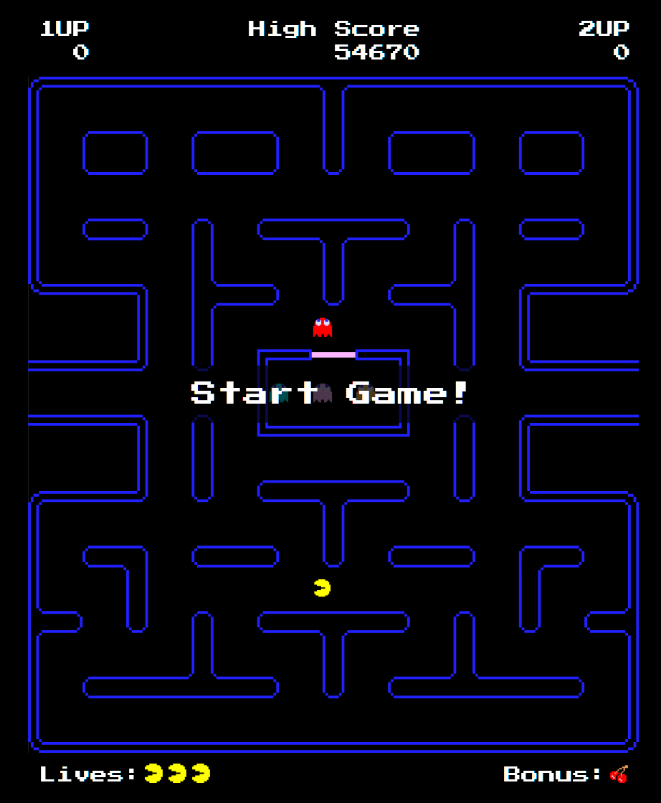
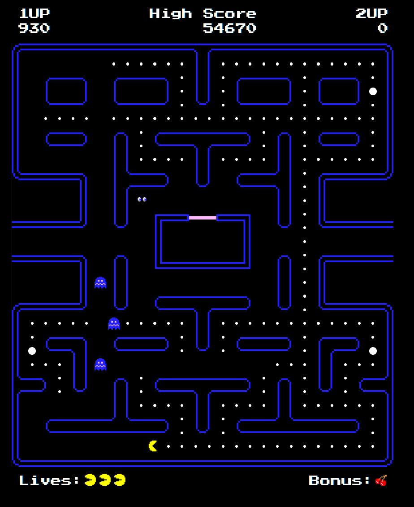
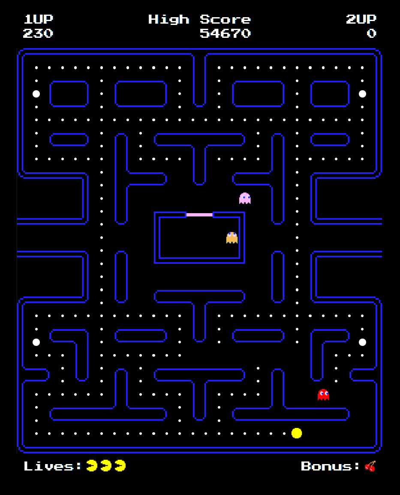

# retro-game-pacman-clone


This is an exercise in keeping my problem-solving and coding skills sharp by creating a Pac-Man clone completely from scratch, without the use of AI.

The goal of this project was to reverse-engineer and implement the classic mechanics—such as individual ghost tracking algorithms, state transitions, and level data rendering—using purely vanilla JS, HTML, and CSS.

<p align="center">
  <a href="https://pacmanclone.surge.sh" target="_blank" style="font-size: 1.5em; font-weight: bold;">🕹️ Give it a spin and play it here! 🕹️</a>
</p>

---

## Project Status (Updated: Jul 1, 2026)

The core gameplay loop is fully complete and functions as a stable, playable MVP! 

### What is working:
* **Responsive Controls:** Fluid Pac-Man movement mapped to both WASD and Arrow Keys.
* **Classic Ghost AI:** Dynamic chase patterns built using individual target tile logic (Blinky tracks directly, Pinky targets ahead, Inky coordinates a vector with Blinky, and Clyde flips based on distance).
* **Power Mechanics:** Chomp "Super-Pellets" to trigger ghost flee behavior, reduce their movement speed, and visually swap them to a blue animation sequence. 
* **Scoring System:** Points are dynamically tracked for eating pellets, consuming fruits, and consecutive ghost chomping. Scores scale appropriately ($200 \rightarrow 400 \rightarrow 800 \rightarrow 1600$).
* **State Management:** Fully functional game-over sequence on total life loss, win-condition resets when a map is cleared of pellets, and localized high-score persistence using HTML5 `localStorage`.
* **Polish:** Fruit bonuses spawn dynamically based on remaining pellet counts, and character sprites utilize multi-frame CSS background-position animation loops.

---

## How to Play

### Controls
* **Move Pac-Man:** Use the `W` `A` `S` `D` keys or the **Arrow Keys** (`↑`, `↓`, `←`, `→`).
* **Start / Pause Game:** Press the `Spacebar`.

### Mechanics
1. **Clear the Board:** Eat all standard pellets on the screen to win the level and advance.
2. **Hunt the Ghosts:** Chomp large Power Pellets to turn the ghosts blue. While they are running away in frightened mode, hunt them down for cascading bonus points!
3. **Score Bonuses:** Keep an eye out for bonus fruits spawning in the center of the maze as your pellet count grows.
4. **Survive:** You start with 3 lives. Avoid contact with the ghosts when they are in normal chase mode, or it's game over.

---

## Key Architectural Challenges & Solutions

Building a complex state machine like Pac-Man without an AI or external engine wrapper introduced some incredible engineering challenges:

### 1. The Ghost Regeneration Loop
Handling what happens when Pac-Man chomps a blue ghost required precise asynchronous timing. The ghost needs to strip its frightened behavior, transform into a set of disembodied eyes, and utilize an alternate pathfinding routine (`moveDeadGhost`) targeted directly back to the ghost house coordinates `[13, 11]`. Once it crosses that threshold, the state machine smoothly toggles them back to a living sprite and re-injects them into the standard game loop.

### 2. Real-Time Math & Target Navigation
Because this grid relies on a precise tile map array ($28 \times 31$ layout), moving characters couldn't just guess their path. To replicate original ghost behavior without hardcoding paths, every intersection forces the game to evaluate the classic Euclidean distance formula against a ghost's unique destination tile:

$$d = \sqrt{(x_2 - x_1)^2 + (y_2 - y_1)^2}$$

The ghost then automatically commits to the direction yielding the absolute lowest distance value, barring a $180^\circ$ reverse turn.

---

## Gameplay Showcases

| Frightened Mode Action | Level Clearing Progression |
| :---: | :---: |
|  |  |

---

## Installation & Local Development

Want to audit the code or play with the configuration values locally?

1. Clone the repository:
```bash
git clone [https://github.com/YOUR_USERNAME/retro-game-pacman-clone.git](https://github.com/YOUR_USERNAME/retro-game-pacman-clone.git)
```

2. Navigate into the directory:
```bash
cd retro-game-pacman-clone
```

3. Because the game utilizes ES Modules (`type="module"`), you must serve it over a local server environment rather than just opening the `index.html` file directly. You can use VS Code's **Live Server** extension, or run Python's built-in tool:
```bash
python -m http.server
```

4. Open your browser and go to `http://localhost:8000`.

---

## Future Implementations & Ice Box Features
* **Blinky's "Cruise Elroy" Mode:** Dynamically scale Blinky’s base speed threshold down relative to remaining pellet counts on the board.
* **Level Designer:** Create an interactive UI map-builder enabling players to draw custom walls and export fresh JSON level matrices.
* **Web-Socket Multiplayer:** A challenge mode where additional players can drop in over a network socket to manually command the ghost array.

---

## File Structure

```text
├── assets/
│   ├── bonusSprites/       # Dynamic SVG reward items (fruits, keys)
│   ├── characterSprites/   # Multi-frame direction sheets for Pac-Man and ghosts
│   ├── mazeSprites/        # Core structural map environment tiles
│   └── screenshots/        # Project showcase captures for documentation and previews
├── css/
│   └── styles.css          # Monolithic retro layout, animations, and game-canvas rules
├── data/
│   └── levels.js           # Multi-dimensional structural maps via JSON format arrays
├── js/
│   └── index.js            # Core tick-based game loop engine using requestAnimationFrame
├── .gitignore
├── CNAME
├── index.html              # Core SPA anchor node with meta parsers and tracking layers
└── README.md
```

## Game Grid Design Legend
Tile configurations are parsed straight from raw JSON arrays and instantiated into matching DOM elements using a standardized index mapping scheme:

| Index Value | Map Representation |
| :--- | :--- |
| `0` | Empty Corridor |
| `1` - `4` | Single-Lined Perimeter Corners |
| `5` - `6` | Single-Lined Walls (Horizontal / Vertical) |
| `9` | Ghost House Gate Barrier |
| `10` - `15` | Double-Lined Structural Borders & Intersections |
| `60` - `65` | Fruit Assets (Cherry, Strawberry, Orange, Apple, Melon, Galaxian, Bell, Key) |
| `70` - `74` | Initial Starting Vectors (Pac-Man, Blinky, Pinky, Inky, Clyde) |
| `80` | Standard Pellet (10 Points) |
| `81` | Power Pellet (50 Points + Frightened Phase) |

---

## Notable Reference Material
* [Pac-Man Fandom Wiki - Ghost Species Mechanics](https://pacman.fandom.com/wiki/Ghost_(species))
* [The Book of Pac-Man: Understanding Target Coordinates & Cruise Elroy](https://pacman.fandom.com/wiki/Cruise_Elroy)
* Detailed breakdown of the original hardware resolution specs (224 x 288 pixel canvas distributed across an active 28 x 31 coordinate tile environment, leaving room for top and bottom status bars).